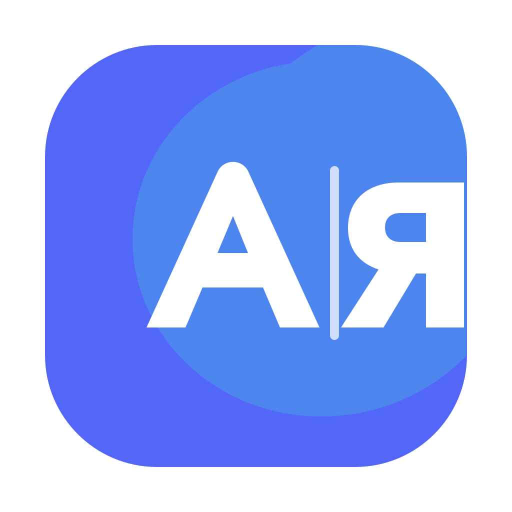

# Nabira

<p align="center">
  
</p>

<p align="center">
  <b>Smart typing for macOS</b><br>
  Layout correction, typo fixing and local adaptive learning
</p>

<p align="center">
  <sub>macOS app lives in <a href="macos/">macos/</a> · Windows version is <a href="windows/">planned</a> · cross-platform behaviour contract in <a href="shared/">shared/</a></sub>
</p>

<p align="center">
  <a href="https://github.com/mitfleg/Nabira/releases/latest"></a>
  <a href="LICENSE"></a>
  
  
</p>

<p align="center">
  <a href="#english">English</a> · <a href="#русский">Русский</a>
</p>

<p align="center">
  <a href="https://github.com/mitfleg/Nabira/releases/latest"><b>⬇️ Download for macOS</b></a>
  &nbsp;·&nbsp;
  <a href="https://github.com/mitfleg/Nabira/releases/latest">Скачать для macOS</a>
</p>

---

## English

Typed `ghbdtn` when you meant `привет`? Just tap **Option ⌥** and Nabira converts the last word into the right layout — typing it directly, no copy-paste. Works with any pair of installed keyboard layouts — Russian, Ukrainian, Belarusian, German, French, and more. The trigger is fully configurable (a single key or a two-key combo), it can also fix the layout **automatically as you type**, and it even works through **Apple Screen Sharing**.

### How it works

| Action | Result |
|---|---|
| Type a word, tap **Option ⌥** | Last typed word is converted |
| Tap **Option ⌥** again | Reverse conversion (undo) |
| Select text, tap **Option ⌥** | Selected text is converted |

The trigger is configurable — **Option**, **Command**, **Control** or **Shift** (left or right side, single or double-tap), or a **two-key combo** (⌘+⇧, ⌃+⇧, ⌘+⌥, ⌃+⌥) for the Windows-style Alt+Shift feel.

### Automatic conversion (beta)

Nabira can also fix the layout **automatically as you type**, with no key press. Turn it on in **Settings → Auto-conversion** (off by default). When you finish a word with Space or submit it with Enter, Nabira checks the word against the macOS system dictionary and — only when confident — converts it before continuing or submitting.

Words with trailing punctuation are handled too *(new in 2.7.0)*: `ghbdtn,` becomes `привет,` — the punctuation stays exactly as typed. Genuinely ambiguous tails are left alone on purpose: on the Russian layout the EN keys `. , ; :` are the letters `ю б ж Ж`, so `levf.` could mean either «думаю» or «дума.» — such words are yours to convert with the manual trigger.

Precision-first: one-letter words are resolved only from the next reliable word (`F ns` → `А ты`, while `I From` stays English); frequent two-letter words use a compact allow-list. Words with digits / URLs / punctuation in the middle, ALL-CAPS acronyms typed with Shift, camelCase / mixed-script code identifiers, terminals / IDEs / password managers, and password fields are skipped. It targets layout pairs that have a macOS system dictionary (English ↔ Russian / Ukrainian / German / French… are reliable); languages without one (Belarusian, Armenian, Georgian) keep using the manual trigger.

**Local adaptive learning** is enabled by default. If Nabira makes an automatic correction, you delete it and type the original word again, it offers to keep that word unchanged in the future. Repeating the same manual word conversion teaches the opposite rule and offers to add the target form to **Always convert**. Recent reliable words also provide a conservative per-app language context for resolving dictionary collisions. All learning data stays in your macOS user profile and is never sent anywhere.

### Russian ё correction

Enable **Automatically insert ё** in **Settings → Auto-conversion** to correct Russian words after Space. The bundled OpenCorpora-derived dictionary contains only unambiguous forms: `ежик` becomes `ёжик`, while `все/всё` and similar context-dependent spellings stay untouched. The feature is local, works offline, preserves capitalization, and can be undone with the conversion trigger.

### Russian and English typo correction

The built-in corrector fixes confident spelling mistakes after Space: `превет` → `привет`, `Карова` → `Корова`, `bokk` → `book`, `adress` → `address`. AppleSpell supplies language-aware candidates; bundled RU/EN frequency lists and typo-structure scoring choose the safe result. It works offline, is enabled by default, keeps capitalization, respects app/word exceptions, and can be undone with the conversion trigger. Correct words, names, ALL-CAPS abbreviations, camelCase and mixed-script identifiers are left untouched.

Because the check relies on the **macOS system dictionary** — which is less complete than the real vocabulary of the languages it converts — some compound, rare or slang words won't auto-convert on their own. That's exactly what the built-in exception lists are for: add words you type often to **Always convert** (or **Never convert**) and Nabira will handle them the way you want, no dictionary needed.

**Three exception lists** let you tune it (Settings → Auto-conversion):
- **Apps** — where auto-conversion stays off (terminals, IDEs and password managers are pre-filled; password managers can't be removed).
- **Never convert** — words it must never touch (nicknames, logins, brands). After a wrong fix, tap the trigger to undo and Nabira offers to add the word here.
- **Always convert** — words to always fix even if they aren't in the dictionary (compound words, slang). Add the **target** word — the result you want.

### Hebrew — right-to-left, experimental (new in 3.0)

Nabira's **first right-to-left layout**. Any layout pair involving Hebrew now converts: typed `akuo` in the wrong layout? One tap makes it `שלום`, in either direction, with any second layout. Because conversion is keycode-based, right-to-left text is handled safely and niqqud marks are never reordered.

**Automatic conversion for Hebrew pairs is deliberately conservative** — the macOS Hebrew dictionary accepts any letter sequence, so auto only fires on a positive signal (you typed in Hebrew but the word is a real word of your other layout's language). The reverse direction is left to the manual trigger — no corrupted words. This is a new, experimental feature; **the interface itself is not yet localized into Hebrew (RTL UI is planned separately)**, and reports from Hebrew typists are very welcome.

### Layout-switch hotkey (new in 3.0)

Besides the conversion trigger, you can set a **second hotkey that only switches the layout** — no conversion — in Settings. It supports modifier-only combos like **Ctrl+Shift** that macOS system settings can't assign, plus **right-key-only** and **double-tap** options (e.g. double-Shift to switch). Off by default.

### Remote desktop (beta — new in 2.5)

Nabira works through **Apple Screen Sharing**. Type into a remote Mac's session and fix wrong-layout text right there — by trigger or automatically — just like on your local machine. Run Nabira on **both** Macs and turn on **Remote Desktop mode** (beta, marked in the menu). Conversion happens on the Mac you're controlling, where the text actually lives.

### Layout flag at the cursor (beta — new in 2.6)

After you switch layout, Nabira can briefly show the layout flag **right next to the text cursor** — so you see which layout you're in without glancing at the menu bar. It hides as you start typing. Turn it on in the menu or Settings (off by default). It works wherever the app exposes the cursor position via Accessibility (native apps and most text fields); a few apps that draw their own text (e.g. the VS Code editor) don't expose it — there macOS's own input indicator covers the gap.

### Features

- **Any two layouts** — configure any pair from your installed system layouts. No hardcoded tables.
- **Hebrew — right-to-left (experimental, new in 3.0)** — the first RTL layout; convert to/from Hebrew with any second layout. Auto-conversion is conservative by design; the manual trigger works both ways.
- **Switch layout from the menu** *(new in 2.6.1)* — pick any installed layout right from the menu-bar menu (flag, name, a check on the current one) and click to switch.
- **Configurable trigger** — Option, Command, Control or Shift (left/right, single/double-tap), or a two-key combo like ⌘+⇧.
- **Layout-switch hotkey** *(new in 3.0)* — a separate hotkey that only switches the layout (no conversion), including Ctrl+Shift and other modifier-only combos macOS can't assign; right-key-only and double-tap options. Off by default.
- **Automatic conversion (beta)** — optionally fix the layout as you type, with a precision-first system-dictionary check. Off by default.
- **Russian and English typo correction** — confidently fixes ordinary spelling mistakes after Space, offline and enabled by default.
- **Russian ё correction** — an optional offline OpenCorpora-based yoficator that changes only unambiguous forms. Off by default.
- **Remote desktop (beta)** — fix the layout over Apple Screen Sharing, on the Mac you're controlling.
- **Exception lists** — a per-app exclusion list plus never-convert and always-convert word lists.
- **Layout sound (optional)** — a short sound on the first letter after a layout change, so you *hear* which layout you're in.
- **Layout flag at the cursor (beta)** — briefly show the layout flag next to the text cursor right after a switch.
- **Monochrome menu-bar icon (optional)** *(new in 2.6.1)* — a system-style `РУ/EN` badge instead of the colored flag; adapts to light/dark automatically. Off by default.
- **Universal binary** — runs natively on both Apple Silicon and Intel Macs.
- **Clipboard-free** — the converted word is typed directly via synthesized Unicode, so it works even in Electron / VS Code / Atom-class editors. Your clipboard is never touched (it's only a fallback for unusual apps).
- **Smart word detection** — converts the last typed word, including punctuation.
- **Selected text** — select any text and tap the trigger to convert it in place.
- **Tap again to undo** — reverse conversion if you changed your mind.
- **Per-app layout memory** — remembers the active layout for each application and restores it when you switch back.
- **16 interface languages** — English, Русский, Українська, Беларуская, Deutsch, Français, Español, Português, Polski, 中文, 日本語, 한국어, Ελληνικά, Български, Հայերեն, ქართული.
- **Auto-start at login** — set and forget.
- **Minimal footprint** — no Electron, no web views, pure Swift + AppKit.
- **No telemetry** — your keystrokes stay on your Mac.
- **Private trial check** — the backend receives only a SHA-256 device fingerprint and trial/account status; typed text is never sent.

### Installation

**Download DMG**

Grab the latest `.dmg` from [**Releases**](https://github.com/mitfleg/Nabira/releases/latest), open it and drag Nabira to Applications.

**Build from source**

```bash
git clone https://github.com/mitfleg/Nabira.git
cd Nabira
bash build_app.sh
cp -R Nabira.app /Applications/
```

Requires macOS 13+ and Xcode Command Line Tools.

### Permissions

On first launch, Nabira requests two macOS permissions:

1. **Accessibility** — to read and modify text in applications.
2. **Input Monitoring** — to detect keyboard events.

The app adds itself to the permission lists automatically — you only need to flip the toggles. The built-in permission wizard walks you through it step by step.

### Technical details

- `CGEventTap` (passive, listen-only) for keyboard monitoring.
- `UCKeyTranslate` (Carbon) for dynamic character mapping between any layout pair.
- `CGEvent.keyboardSetUnicodeString` to type the converted text directly — no clipboard, no pasteboard side effects.
- `CGEventSource.userData` marker to filter the app's own simulated events.
- `AXUIElement` API for focused element detection.
- `SMAppService` for login item management.
- No hardcoded layout tables — works with any installed layouts.

### Settings

Access via the menu bar icon → **Settings** (⌘,).

- **General** — conversion trigger (single key or combo), per-app layout memory, launch at login, interface language, layout pair.
- **Auto-conversion** — automatic conversion, local adaptive learning, typo correction, ё correction, **Remote Desktop mode (beta)**, and the three exception lists (apps, never-convert, always-convert).
- **About** — version, contact, repository, and update checks.
- **Advanced** — debug logging, log management.

The menu-bar menu also has quick toggles for Automatic conversion, Layout sound, Flag at cursor and Remote Desktop mode.

### Contact

Questions and feedback: **mitfleg@icloud.com** · Telegram: **[@mitfleg](https://t.me/mitfleg)**. You can also star this repository on GitHub.

### License

[MIT](LICENSE) — free to use, modify, and distribute.

---

## Русский

Набрали `ghbdtn` вместо `привет`? Просто нажмите **Option ⌥** — и Nabira сконвертирует последнее слово в правильную раскладку, печатая его напрямую, без копипасты. Работает с любой парой установленных раскладок — русская, украинская, белорусская, немецкая, французская и другие. Триггер настраивается (одна клавиша или комбо из двух), есть **автоматическая конверсия по ходу набора**, и всё это работает даже через **Apple Screen Sharing**.

### Как работает

| Действие | Результат |
|---|---|
| Набрать слово, нажать **Option ⌥** | Последнее слово сконвертировано |
| Нажать **Option ⌥** повторно | Обратная конвертация (отмена) |
| Нажать **⌘⌥Z** сразу после автоправки | Отменить последнюю правку Nabira |
| Выделить текст, нажать **Option ⌥** | Выделенный текст сконвертирован |

Триггер настраивается — **Option**, **Command**, **Control** или **Shift** (левый или правый, одиночный или двойной тап), либо **комбо из двух клавиш** (⌘+⇧, ⌃+⇧, ⌘+⌥, ⌃+⌥) — в стиле привычного Alt+Shift.

### Автоматическая конверсия (бета)

Nabira умеет исправлять раскладку **автоматически по ходу набора**, без нажатий. Включается в **Настройки → Автоконверсия** (по умолчанию выключено). После пробела приложение исправляет слово как раньше, а при обычном Enter сначала завершает уверенную автозамену и только потом отправляет текст.

Слова с прилипшим знаком препинания тоже обрабатываются *(новое в 2.7.0)*: `ghbdtn,` превратится в `привет,` — знак останется ровно как набран. По-настоящему неоднозначные хвосты не трогаем сознательно: клавиши `. , ; :` английской раскладки — это буквы `ю б ж Ж` в ЙЦУКЕН, так что `levf.` может означать и «думаю», и «дума.» — такие слова конвертируйте ручным триггером.

Точность важнее полноты: однобуквенное слово определяется только по следующему надёжному слову (`F ns` → `А ты`, но `I From` остаётся английским), а частые двухбуквенные слова — по компактному белому списку. Слова с цифрами / URL / пунктуацией в середине, акронимы капсом через Shift, camelCase / смешанные алфавиты (идентификаторы кода), терминалы / IDE / менеджеры паролей и поля паролей пропускаются. Работает для пар раскладок, у которых есть системный словарь macOS (английский ↔ русский / украинский / немецкий / французский… — надёжно); для языков без словаря (белорусский, армянский, грузинский) остаётся ручной триггер.

**Локальное самообучение** включено по умолчанию. Если Nabira сделал автозамену, а вы удалили её и снова набрали исходное слово, приложение предложит больше его не трогать. Повторная ручная конвертация одного слова обучает обратному правилу и предлагает добавить целевую форму в **«Всегда конвертировать»**. Последние надёжные слова также образуют осторожный контекст языка отдельно для каждого приложения и помогают разрешать словарные коллизии. Все данные обучения остаются только в профиле macOS и никуда не отправляются. В настройках видны накопленные правила: отдельные записи удаляются кнопкой **−**, а кнопка **«Сбросить обучение…»** очищает все словарные правила и наблюдения.

### Ёфикатор

Включите **«Автоматически расставлять ё»** в **Настройки → Автоконверсия**. После пробела локальный словарь на основе OpenCorpora исправит только однозначные формы: `ежик` → `ёжик`, но `все/всё` и другие контекстно-зависимые варианты останутся без изменений. Регистр сохраняется, интернет не нужен, замену можно отменить триггером конвертации.

### Исправление опечаток на русском и английском

Встроенный корректор после пробела исправляет уверенные ошибки: `превет` → `привет`, `Карова` → `Корова`, `bokk` → `book`, `adress` → `address`. AppleSpell формирует языковые варианты, а локальные частотные словари RU/EN и анализ структуры ошибки выбирают безопасный результат. Функция работает офлайн, включена по умолчанию, сохраняет регистр, учитывает исключения и отменяется триггером конвертации. Правильные слова, имена, сокращения капсом, camelCase и смешанные идентификаторы не меняются.

Поскольку проверка опирается на **системный словарь macOS** — а он не так богат, как реальный словарный запас конвертируемых языков — некоторые составные, редкие или сленговые слова сами не сконвертируются. Ровно для этого и нужны встроенные списки исключений: часто используемые слова добавляйте в **«Всегда конвертировать»** (или **«Никогда не конвертировать»**), и Nabira будет обрабатывать их как вам нужно, без словаря.

**Три списка исключений** для тонкой настройки (Настройки → Автоконверсия):
- **Приложения** — где автоисправления выключены (терминалы, IDE, менеджеры паролей уже в списке; менеджеры паролей удалить нельзя). В меню Nabira есть понятный переключатель с галочкой «Автоисправления в [приложении]».
- **Никогда не конвертировать** — слова, которые трогать нельзя (ники, логины, бренды). После ошибочной замены нажмите триггер для отмены — Nabira предложит добавить слово сюда.
- **Всегда конвертировать** — слова, которые исправлять всегда, даже если их нет в словаре (составные слова, сленг). Добавляйте **целевое** слово — то, что должно получиться.

### Иврит — справа налево, экспериментально (новое в 3.0)

**Первая раскладка с письмом справа налево.** Теперь конвертируется любая пара раскладок с ивритом: набрали `akuo` не в той раскладке? Один тап — и это `שלום`, в обе стороны, с любой второй раскладкой. Конверсия кейкодная, поэтому RTL-текст обрабатывается безопасно, а огласовки (никуд) никогда не переставляются.

**Авто-конверсия для пар с ивритом сознательно консервативна** — системный ивритский словарь macOS принимает любой набор букв, поэтому авто срабатывает только при положительном сигнале (вы набрали в иврите, а слово — настоящее слово языка второй раскладки). Обратное направление — ручным триггером, никаких испорченных слов. Это новая, экспериментальная функция; **сам интерфейс пока не переведён на иврит (RTL-интерфейс — отдельным этапом)**, и отзывы от тех, кто печатает на иврите, очень приветствуются.

### Хоткей переключения раскладки (новое в 3.0)

Помимо триггера конверсии можно назначить **второй хоткей, который только переключает раскладку** — без конверсии — в Настройках. Поддерживает комбо из одних модификаторов вроде **Ctrl+Shift**, которые системные настройки macOS назначить не позволяют, плюс опции **только правая клавиша** и **двойной тап** (например, двойной Shift → смена). По умолчанию выключен.

### Режим удалённого стола (бета — новое в 2.5)

Nabira работает через **Apple Screen Sharing**. Печатаете в сессии удалённого Mac — и неправильная раскладка исправляется прямо там, по триггеру или автоматически, как на локальной машине. Запустите Nabira на **обеих** машинах и включите **Режим удалённого стола** (бета, помечен в меню). Конверсия происходит на управляемой машине, где и находится текст.

### Флаг у курсора (бета — новое в 2.6)

После переключения раскладки Nabira может ненадолго показать флаг раскладки **прямо у текстового курсора** — видно, в какой раскладке печатаете, не глядя в меню-бар. Прячется, как только начинаете печатать. Включается в меню или Настройках (по умолчанию выключено). Работает там, где приложение отдаёт позицию курсора через Accessibility (нативные приложения и большинство текстовых полей); некоторые приложения, рисующие текст сами (например, редактор VS Code), позицию не отдают — там раскладку показывает встроенный индикатор macOS.

### Возможности

- **Любая пара раскладок** — настраивается любая пара из установленных в системе. Без захардкоженных таблиц.
- **Иврит — справа налево (экспериментально, новое в 3.0)** — первая RTL-раскладка; конверсия в/из иврита с любой второй раскладкой. Авто-конверсия консервативна by design; ручной триггер работает в обе стороны.
- **Переключение раскладки из меню** *(новое в 2.6.1)* — выберите любую установленную раскладку прямо в меню-баре (флаг, имя, галочка на текущей) и кликните для переключения.
- **Настраиваемый триггер** — Option, Command, Control или Shift (левый/правый, одиночный/двойной тап), либо комбо из двух клавиш вроде ⌘+⇧.
- **Хоткей переключения раскладки** *(новое в 3.0)* — отдельный хоткей только для смены раскладки (без конверсии), включая Ctrl+Shift и другие комбо модификаторов, недоступные системным настройкам; опции «только правая» и «двойной тап». По умолчанию выключен.
- **Автоматическая конверсия (бета)** — опционально исправляет раскладку по ходу набора, с проверкой по системному словарю. По умолчанию выключено.
- **Исправление опечаток RU/EN** — после пробела локально исправляет уверенные ошибки. По умолчанию включено.
- **Ёфикатор** — опционально и локально расставляет `ё` только в однозначных формах из словаря OpenCorpora. По умолчанию выключен.
- **Режим удалённого стола (бета)** — исправление раскладки через Apple Screen Sharing, на управляемой машине.
- **Списки исключений** — список приложений плюс словари never-convert и always-convert.
- **Звук раскладки (опционально)** — короткий звук на первой букве после смены раскладки, чтобы *на слух* понимать раскладку.
- **Флаг у курсора (бета)** — ненадолго показывает флаг раскладки у текстового курсора сразу после переключения.
- **Монохромная иконка в меню-баре (опционально)** *(новое в 2.6.1)* — системная плашка `РУ/EN` вместо цветного флага, сама подстраивается под светлую/тёмную тему. По умолчанию выключена.
- **Universal-сборка** — нативно на Apple Silicon и Intel.
- **Без буфера обмена** — конвертированное слово печатается напрямую через синтез Unicode, поэтому работает даже в Electron / VS Code / Atom. Буфер обмена не трогается (только как запасной вариант для нестандартных приложений).
- **Умное определение слова** — конвертирует последнее набранное слово, включая знаки препинания.
- **Выделенный текст** — выделите любой текст и нажмите триггер для конвертации на месте.
- **Повторное нажатие — отмена** — обратная конвертация, если передумали.
- **Память раскладки по приложению** — запоминает активную раскладку для каждой программы и восстанавливает при возврате.
- **16 языков интерфейса** — English, Русский, Українська, Беларуская, Deutsch, Français, Español, Português, Polski, 中文, 日本語, 한국어, Ελληνικά, Български, Հայերեն, ქართული.
- **Автозапуск при входе** — настроил и забыл.
- **Минимальное потребление** — без Electron и веб-вьюх, чистый Swift + AppKit.
- **Без телеметрии** — ваши нажатия остаются на вашем Mac.
- **Приватная проверка trial** — backend получает только SHA-256-отпечаток устройства и статус trial/аккаунта; набранный текст не отправляется.

### Установка

**Скачать DMG**

Скачайте последний `.dmg` со страницы [**Releases**](https://github.com/mitfleg/Nabira/releases/latest), откройте и перетащите Nabira в «Программы».

**Сборка из исходников**

```bash
git clone https://github.com/mitfleg/Nabira.git
cd Nabira
bash build_app.sh
cp -R Nabira.app /Applications/
```

Требуется macOS 13+ и Xcode Command Line Tools.

### Разрешения

При первом запуске Nabira запросит два системных разрешения macOS:

1. **Универсальный доступ (Accessibility)** — для чтения и изменения текста в приложениях.
2. **Мониторинг ввода (Input Monitoring)** — для отслеживания нажатий клавиш.

Программа автоматически добавляется в списки разрешений — вам нужно только включить тумблеры. Встроенный мастер разрешений проведёт по шагам.

### Технические детали

- `CGEventTap` (пассивный, только чтение) для мониторинга клавиатуры.
- `UCKeyTranslate` (Carbon) для динамического маппинга символов между любой парой раскладок.
- `CGEvent.keyboardSetUnicodeString` для прямой печати конвертированного текста — без буфера обмена и побочных эффектов с pasteboard.
- Маркер `CGEventSource.userData` для фильтрации собственных симулированных событий.
- `AXUIElement` API для определения сфокусированного элемента.
- `SMAppService` для управления автозапуском.
- Без захардкоженных таблиц — работает с любыми установленными раскладками.

### Настройки

Доступ через иконку в строке меню → **Настройки** (⌘,).

- **Общие** — триггер конвертации (одна клавиша или комбо), память раскладки по приложению, автозапуск, язык интерфейса, пара раскладок.
- **Автоконверсия** — автоматическая конверсия, локальное самообучение, исправление опечаток, ёфикатор, **Режим удалённого стола (бета)** и три списка исключений (приложения, never-convert, always-convert).
- **О программе** — версия, донат, контакт и безопасная установка обновлений с перезапуском.
- **Дополнительно** — режим отладки, управление логами.

В меню в строке меню также есть быстрые тумблеры: «Автоматическая конверсия», «Звук раскладки», «Флаг у курсора» и «Режим удалённого стола».

### Контакты

Вопросы и обратная связь: **mitfleg@icloud.com** · Telegram: **[@mitfleg](https://t.me/mitfleg)**. Также можно поставить звезду репозиторию на GitHub.

### Лицензия

[MIT](LICENSE) — свободное использование, модификация и распространение.
